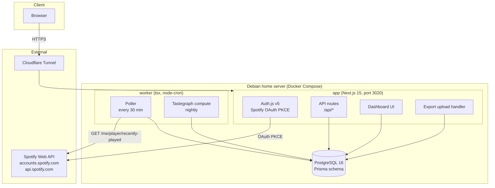

# Architecture

## Component diagram



The app and worker are separate processes/containers sharing one Postgres instance. The app never polls Spotify itself — all recurring Spotify calls live in the worker so a slow request or rate limit never blocks a user's page load.

## Data flow per ingestion path

### 1. GDPR extended streaming history export (primary corpus)

```
User requests export at spotify.com/account/privacy
  → Spotify emails a ZIP (usually 1–5 days later, "extended streaming history")
  → User uploads ZIP via Deepcut dashboard
  → Upload handler creates ExportImport row (status=pending)
  → Parser streams Streaming_History_Audio_*.json files inside the ZIP
  → For each row:
      - upsert Artist (by name, since export has no stable artist ID)
      - upsert Track (by spotify_track_uri if present, else by name+artist)
      - insert Play with source=EXPORT (or EXPORT_ACCOUNT for the shorter
        "account data" export variant, which lacks ms_played/skip fields)
  → ExportImport updated with rowsTotal/rowsImported/rowsSkipped, status=done
```

This is the **only** source of `msPlayed`, `skipped`, `reasonStart`, `reasonEnd`, and `shuffle` — the API's `recently-played` endpoint never returns them. A user who never uploads an export still gets a tastegraph, just one without completion/skip signal.

### 2. Live polling (ongoing source of truth going forward)

```
worker cron, every POLL_INTERVAL_MINUTES (default 30):
  for each SpotifyAccount with a valid (or refreshable) token:
    GET /me/player/recently-played?after={pollCursor}&limit=50
    for each item:
      upsert Artist / Track from the embedded track object
      insert Play with source=POLL, msPlayed=null, skipped=null,
        reasonStart=null, reasonEnd=null (API doesn't provide these)
    advance pollCursor to the played_at (ms) of the newest item returned
    update SpotifyAccount.lastPolledAt
```

`recently-played` only returns the last ~50 plays, so anything beyond that window between polls is silently lost — this is why the 30-minute cadence matters more than it would for a bulk API. If the access token is expired, the poller performs a refresh-token grant first (see [Token encryption](#token-encryption-design)).

### 3. Top items as cold-start prior

Before a user's first poll cycle or export import has produced enough plays to compute a meaningful snapshot, `/me/top/tracks` and `/me/top/artists` (short/medium/long term) are used as a low-confidence prior so the dashboard isn't empty on day one. These are never written as `Play` rows — they inform initial `TasteSnapshot.score` only and are superseded as real play data accumulates.

### 4. Future: scrobble services (Last.fm / ListenBrainz)

Opt-in, Phase 3+. Would ingest as another `Play.source` value, subject to the same dedupe rule below. Primary purpose is redundancy and the only realistic path to scale past Spotify's 5-user dev-mode cap (see [SPOTIFY-CONSTRAINTS.md](./SPOTIFY-CONSTRAINTS.md)).

### 5. Future: enrichment (MusicBrainz, Last.fm tags, AcousticBrainz)

Batch/lazy jobs that annotate existing `Artist`/`Track` rows (genres, mood, BPM, key) — they don't create `Play` rows and aren't part of the ingestion dedupe problem.

## Dedupe strategy

Every play is written under the constraint:

```prisma
@@unique([userId, trackId, playedAt])
```

**Why `playedAt` is safe to dedupe on across sources:** both the export's `ts` field and the API's `played_at` field represent the *end* of the stream (end-of-track or the moment playback stopped), not the start. So a track played once, whether captured by the export or the poller, produces the same `playedAt` timestamp within API precision — the unique constraint collapses accidental double-writes automatically for exact matches.

**Why an exact match isn't the whole story:** the export's `ts` and the poller's `played_at` aren't always bit-identical for the same real-world play — client-side buffering and Spotify's own logging can shift them by a second or two. The importer therefore applies an additional check before inserting an `EXPORT` row: if a `POLL` row already exists for the same `(userId, trackId)` with `playedAt` within **±120 seconds**, the export row is skipped and counted in `ExportImport.rowsSkipped`. This only runs in the export→POLL direction (exports are batch-imported after poll data may already exist for recent history); poll writes never scan backward against exports since polling only ever looks forward from `pollCursor`.

Net effect: a user who polls for months and then uploads a fresh export doesn't end up with the same last few weeks of listening counted twice.

## Token encryption design

`SpotifyAccount.accessTokenEnc` and `.refreshTokenEnc` store tokens encrypted with **AES-256-GCM**, keyed by `TOKEN_ENCRYPTION_KEY` (32-byte hex, generated with `openssl rand -hex 32`, held only in the server's `.env` — never in the database or the repo).

- Each encryption generates a fresh random IV; ciphertext, IV, and GCM auth tag are concatenated/encoded together into the stored string so a single column holds everything needed to decrypt.
- Tokens are decrypted in-process, only inside the worker (for polling) or an API route (for user-initiated actions like playlist writes in later phases) — never sent to the browser.
- On refresh (Auth.js v5 refresh-token rotation), the new access/refresh token pair is re-encrypted and overwrites the stored values; `expiresAt` is updated accordingly.
- If decryption fails (e.g. key rotated without a migration), the account is treated as needing re-auth rather than crashing the poll cycle — that account is skipped for the current run and flagged.

This protects against database-only compromise (e.g. a leaked backup); it does not protect against compromise of the app server itself, which holds the key in memory.

## Worker schedule

Single `worker/index.ts` process, `node-cron`-driven, two jobs:

| Job | Cadence | Responsibility |
|---|---|---|
| Poller | every `POLL_INTERVAL_MINUTES` (default 30) | For each connected account: refresh token if needed, call `recently-played`, upsert artists/tracks, insert new `Play` rows, advance `pollCursor` |
| Tastegraph compute | nightly (fixed low-traffic hour) | For each user, recompute `TasteSnapshot` rows across all entity types and windows |

The worker is a separate container/process from the app so a stuck or slow job never affects request latency, and so it can be restarted independently.

## Tastegraph computation design

### Windows

`ALL`, `R30`, `R90`, `R180`, `R360` (rolling day counts from "now"), and per-calendar-year buckets (`Y2023`, `Y2024`, ...). Rolling windows are recomputed nightly against the current date rather than stored as fixed date ranges, so yesterday's `R30` naturally ages out old plays without a separate cleanup step.

### Signals (v0)

For each `(userId, entityType, entityId, window)`:

- **Play count** — raw count of `Play` rows in that window (entity = track, or rolled up to artist/genre via the track's `artistId`/`Artist.genres`).
- **Play-percent average** — mean of `msPlayed / durationMs` across plays that have `msPlayed` (i.e. `EXPORT`/`EXPORT_ACCOUNT` sourced, since `POLL` rows never carry it), computed for all-time, last-180-day, and most-recent-play variants, then rolled up to album/artist level.
- **Relationship counts** — count of *other* plays by the same artist, and *other* plays within the same genre, both computed per-window so they can be split over time the same way play counts are.
- **Score** — a deterministic weighted combination of the above (weights TBD in Phase 1; v0 ships with a simple, documented formula in code rather than a config file, so it stays inspectable). Computed in SQL aggregate queries / TypeScript over the `Play` table, not a trained model — see the "not ML" framing in [SPOTIFY-CONSTRAINTS.md](./SPOTIFY-CONSTRAINTS.md).

### Snapshot upserts

Nightly compute writes/overwrites `TasteSnapshot` rows via the unique key `(userId, entityType, entityId, window)` — each run is a full recompute-and-upsert per user, not an incremental delta, which keeps the logic simple and self-healing (a bad snapshot is fixed by the next nightly run rather than requiring a backfill script). The composite index `(userId, window, entityType, score DESC)` supports the dashboard's "top N in this window" queries directly.

## Deployment topology

- **Host**: Debian home server (`ssh debian`, `ben@192.168.68.69`).
- **Orchestration**: Docker Compose, three services — `db` (`postgres:16`), `app` (Next.js, published on host port **3020**), `worker` (tsx, no published port, talks to `db` only).
- **Ingress**: Cloudflare Tunnel exposes the app to the public internet without an open inbound port; DNS + TLS handled by Cloudflare. Deepcut shares the tunnel config pattern used by other projects on this host (one `cloudflared` config, multiple service routes).
- **Landing page**: static site in `site/`, deployed separately via GitHub Pages/Actions — decoupled from the app deploy so the marketing page can be public even while the app itself stays invite-only.
- **Secrets**: `.env` on the host only (`DATABASE_URL`, `AUTH_SECRET`, `SPOTIFY_CLIENT_ID/SECRET`, `TOKEN_ENCRYPTION_KEY`); never committed, `.env.example` documents required keys.
